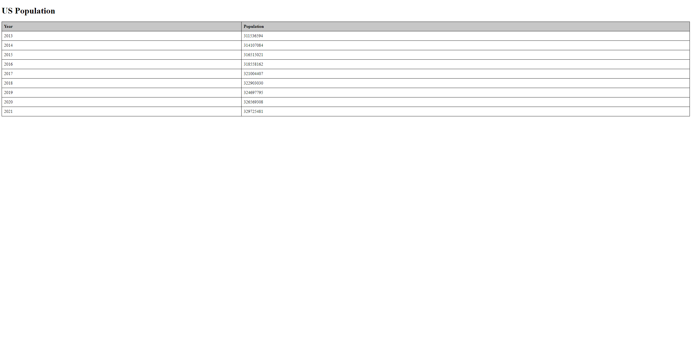

# Assignment 2
# Cade Anderson

# US Population Display Table

This assignment displays US Population data sorted by year and population obtained from the datausa.io API.

## How to Run
- Open the `index.html` file in a web browser.

## Code Structure
- `index.html` contains the HTML structure and JavaScript code for fetching and displaying data.
- Included is standard HTML structure with a styled table for displaying data.
- The <script> section contains all the JavaScript code for fetching data from the api and mapping that data to the previously created table.

## Screenshots

